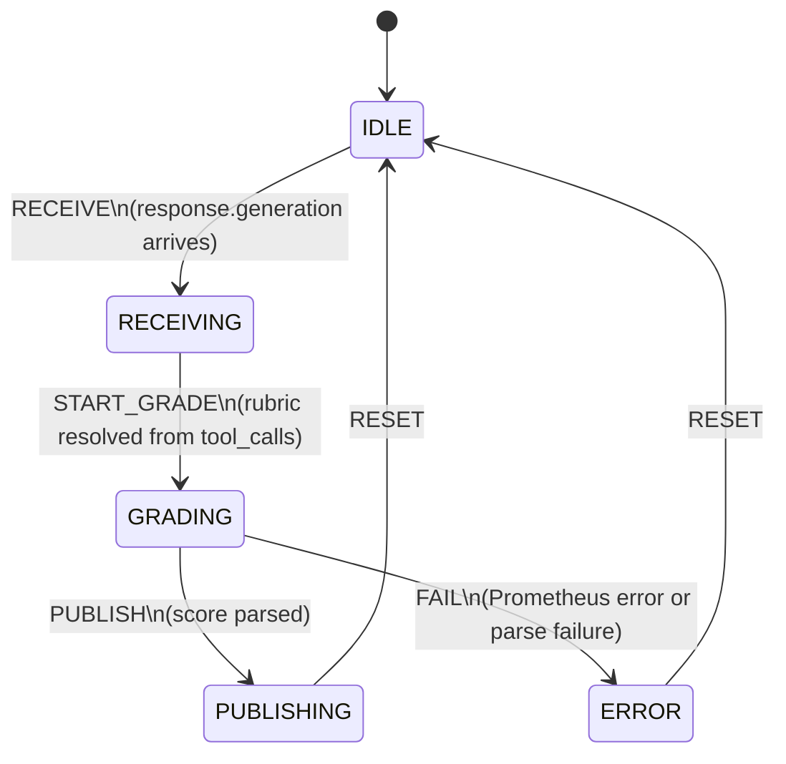

# Critic State Machine

`src/local/agents/critic_states.py`, `critic_transitions.py`, `critic_actions.py`

The critic has a single grading path: absolute quality scoring (1–5) for every final generator response. Rubric selection is deterministic — it reads from the tool registry, not the LLM.

## Key Characteristics

- **Grades all responses:** every response with a non-empty answer is graded, including responses that called tools. The rubric adapts to the response type — no grading is skipped.
- **Rubric selection:** before calling Prometheus, `_resolve_rubric(tool_calls)` scans the tools called and picks the highest-priority tool's declared rubric. No tool calls → default `realistic` rubric.
- **Never blocks answer delivery:** the critic operates asynchronously after the generator has already published. A slow or failed Prometheus call does not affect the user experience.
- **Null score on failure:** on Prometheus failure or regex parse failure, `critique.result` is published with `score=None`. Downstream consumers treat null as "not graded."
