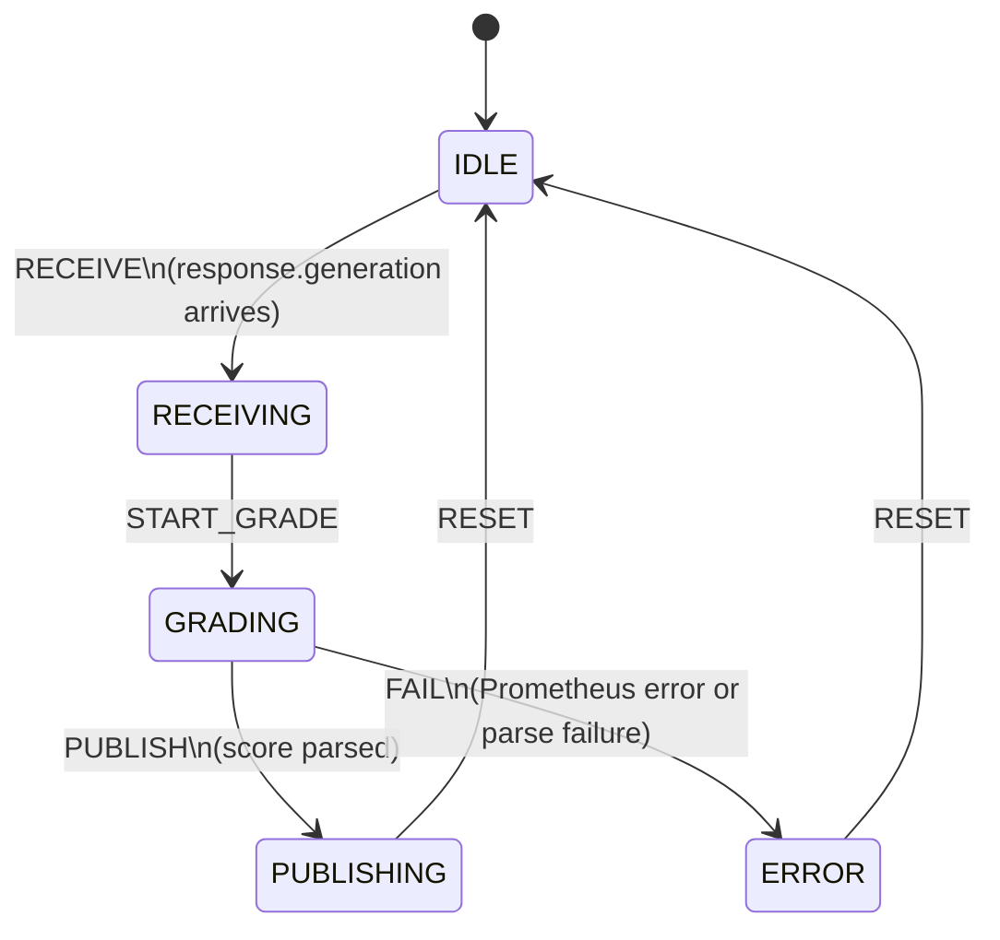

# Critic State Machine

`src/local/agents/critic_states.py`, `critic_transitions.py`, `critic_actions.py`

The critic has a single grading path: absolute quality scoring (1–5) for every final generator response.

## Key Characteristics

- **Skip on tool_calls:** if `response.generation` contains `tool_calls`, grading is skipped — tool-calling turns are partial answers, not final responses.
- **Never blocks answer delivery:** the critic operates asynchronously after the generator has already published. A slow or failed Prometheus call does not affect the user experience.
- **Null score on failure:** on Prometheus failure or regex parse failure, `critique.result` is published with `score=None`. Downstream consumers treat null as "not graded."
