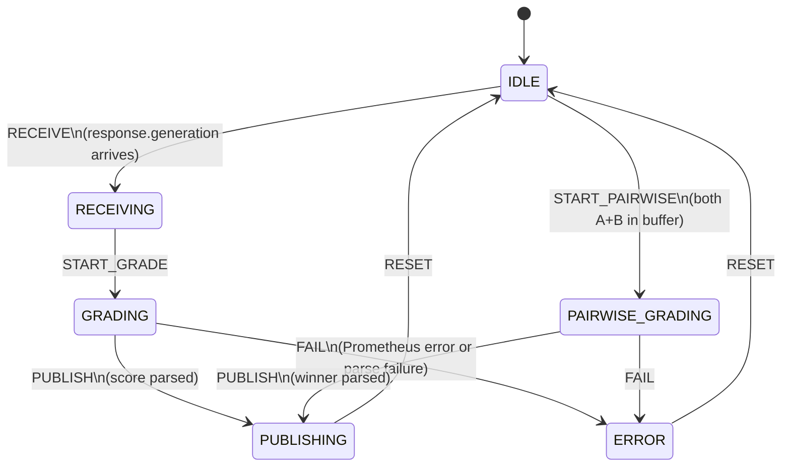

# Critic State Machine

`src/local/agents/critic_states.py`, `critic_transitions.py`, `critic_actions.py`

The critic has two independent paths: absolute grading (one per answer) and pairwise comparison (one per A+B pair). Both paths share PUBLISHING and reset to IDLE.

## Key Characteristics

- **Skip on tool_calls:** if `response.generation` contains `tool_calls`, grading is skipped — tool-calling turns are partial answers, not final responses.
- **RespondentB buffering:** B answers are stored in `_pairwise_buffer` for pairwise comparison but are not graded absolutely. Only RespondentA answers go through the `GRADING` path.
- **Never blocks answer delivery:** the critic operates asynchronously after the generator has already published. A slow or failed Prometheus call does not affect the user experience.
- **Null score on failure:** on Prometheus failure or regex parse failure, `critique.result` is published with `score=None`. Downstream consumers treat null as "not graded."
- **Pairwise buffer eviction:** the buffer holds a maximum of 100 entries. The oldest entry is evicted when the limit is exceeded.
