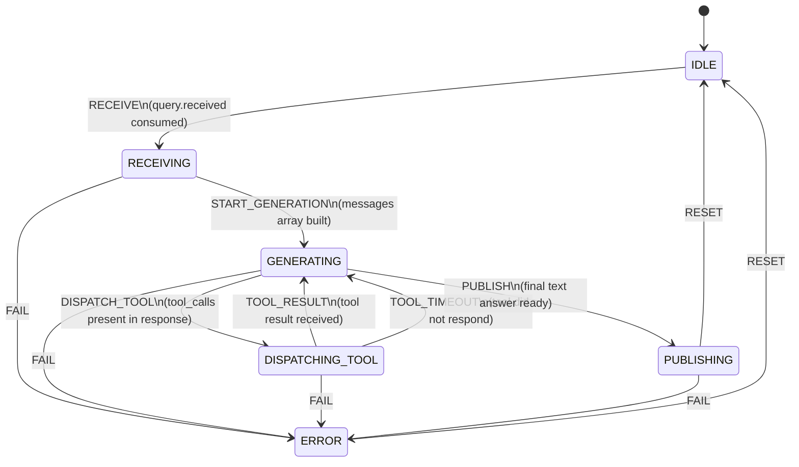

# Generator State Machine

`src/local/agents/generator_states.py`, `generator_transitions.py`, `generator_actions.py`

The generator uses a per-request transaction state machine. State resets to IDLE after every response, error, or compaction. No state is retained between queries.



## Inside the GENERATING state

Each iteration of the tool loop:

```
ollama.chat(stream=True)
  → stream thinking chunks → publish generation.thinking
  → accumulate content
  → capture tool_calls

if tool_calls:
    GENERATING → DISPATCHING_TOOL
    for each tool_call:
        ToolDispatcher publishes tool.call.<name>
        ToolDispatcher waits for tool.result.<name>
        append result to messages
    DISPATCHING_TOOL → GENERATING  ← repeat loop

else:
    GENERATING → PUBLISHING  ← exit loop
```

Max iterations: `max_tool_iterations` (default 5). If exceeded without a final text answer, the last content is returned with a warning.

## Key Characteristics

- **Transaction state only:** state resets after every response or error. No cross-query accumulation.
- **`_do_transition()` wrapper:** every state transition publishes both `agent.transition` and `generator.status` snapshots automatically.
- **Error recovery:** any non-IDLE state can transition to `ERROR` via `FAIL`. A `RESET` action from `ERROR` returns to `IDLE`. The error path always publishes a `response.generation` envelope so the UI shows the error rather than hanging.
- **Compaction:** handled entirely by `ModelService` (a separate bus participant). The generator is not involved.
