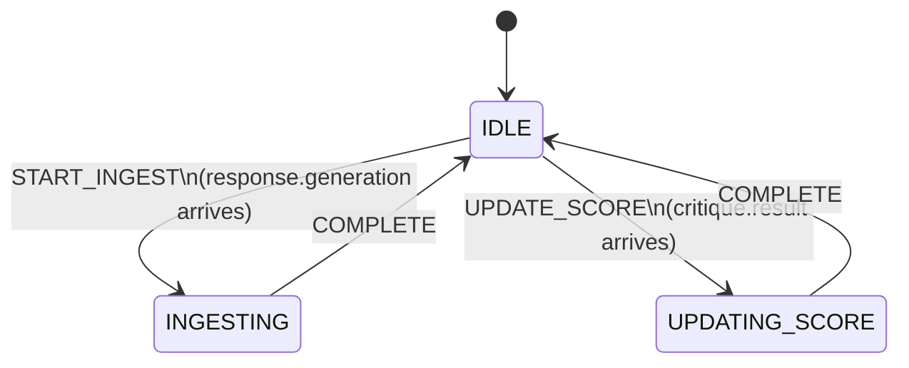

# Memory Agent State Machine

`src/local/agents/memory_agent_states.py`, `memory_agent_transitions.py`, `memory_agent_actions.py`

MemoryAgent handles two independent event types, each with its own IDLE→active→IDLE cycle. All transitions go through a `finally` block so errors never strand the agent in a non-IDLE state.

## Key Characteristics

- **Two independent paths, both resetting to IDLE:** ingest and score annotation are separate event handlers with no inter-dependency.
- **Errors are absorbed:** all handlers are wrapped in `try/except/finally`. On failure, the agent logs the error and transitions to IDLE regardless. The memory store may be incomplete, but the agent never stalls.
- **Classification is best-effort:** the LLM call for intent/entity classification happens before the ChromaDB write. If it fails, the engram is written without those fields.
- **Sequence of annotations for a single query:**
  1. `response.generation` → `INGESTING` → engram created (query_id as ChromaDB document ID)
  2. `critique.result` → `UPDATING_SCORE` → `critic_score` patched on engram
