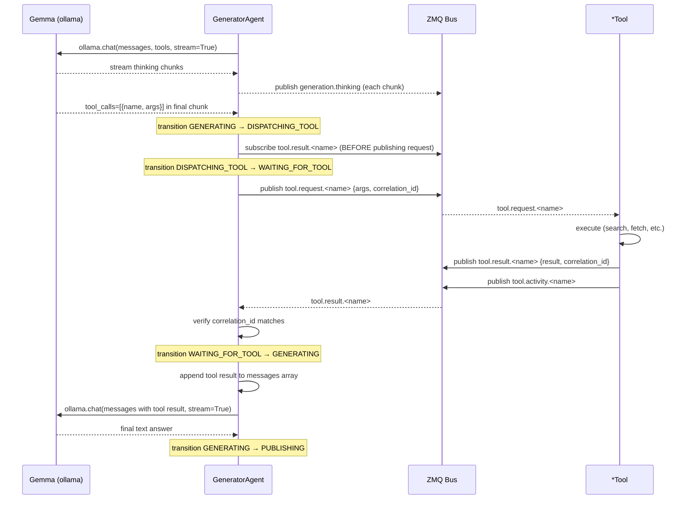

# Tool Call Flow

This diagram shows the sequence of events during a single tool call within a generation turn. The tool call is synchronous from the generator's perspective — the streaming loop pauses while waiting for the result.

## Race-Free Subscribe Pattern

The generator opens the `ZmqSubscriber` for `tool.result.<name>` **before** publishing `tool.request.<name>`. This eliminates the subscribe/publish race: if the tool responds very quickly, the result is already in the ZMQ buffer when the generator starts polling.

## Correlation ID Matching

Every `tool.request.*` envelope carries a `correlation_id` (the query's UUID). The generator only accepts a `tool.result.*` response whose `correlation_id` matches. This prevents cross-query result contamination if a previous timed-out request arrives late.

## Timeout Behavior

If no matching result arrives within `tool_timeout` seconds (default 20s), the generator fires `TOOL_TIMEOUT` (transitioning `WAITING_FOR_TOOL → GENERATING`), substitutes `[tool timeout: '<name>' did not respond within 20s]` as the tool result, and continues generation. Gemma receives this error string as the tool output and can report it to the user.

## Activity Logging

Every tool publishes `tool.activity.<name>` on every request/result cycle. The UI subscribes and displays it in the corresponding ToolWindow's activity log. Activity events are fire-and-forget; no participant depends on them for correctness.
